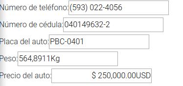
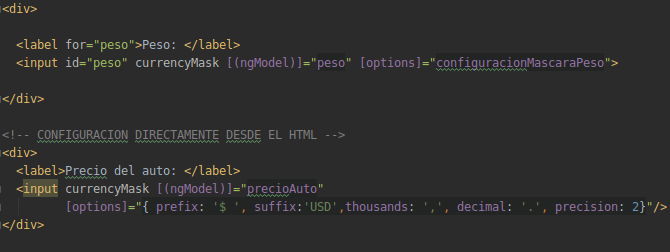

# Máscaras en  Angular 


<p align="center" >
  
</p>


## ¿Qué son las máscaras?

Las máscaras en Angular son patrones de texto que se agregan en los elementos de entrada  que ayuda en la integridad de los datos al requerir
al usuario que ingrese los datos en un formato específico y a su vez, facilita  al usuario 
en como tiene que ingresar los datos.

Comúnmente las máscaras se usan cuando se ingresan información como: número de cédula, pasaporte,
números de teléfono, precios, etc.

<p align="center" >
  
</p>

Para implementar máscaras se puede utilizar los siguientes dos paquetes.
```text
angular2-text mask
ng2-currency-mask
```

Entonces lo primero que se tiene que tener un proyecto de angular (versión: 8) o crear uno nuevo.
Después se abre una terminal y se ubica  en el directorio donde se encuentra el archivo package.json.
Dentro de el directorio instalamos los paquetes de las máscaras.


```text
npm i angular2-text-mask
```
Y después:
```text
npm i ng2-currency-mask
```

Una vez instalados los paquetes se importa los módulos en el módulo principal o en cualquier módulo donde se requiera el uso de las máscaras.

```typescript
import { NgModule } from '@angular/core';
import { FormsModule } from '@angular/forms';
import { TextMaskModule } from 'angular2-text-mask';
import {CurrencyMaskModule} from "ng2-currency-mask";
 
@NgModule({
  imports: [
    FormsModule,
    TextMaskModule, // angular2-text-mask
    CurrencyMaskModule, // currency-mask

  ],
  declarations: []
})
export class MyModule {}
```


Siguiente paso es utilizarlas en el componente. Para ello se puede configurar dentro del archivo html o el ts.

**Consejo**: Programar en el archivo .ts del componente ayudará a tener una limpieza en nuestro código y lo hace mantenible.
 
 ## Implementación con angular2-text-mask
 A continuación se va explicar ejemplo usando **angular2-text-mask**.
 
 * La manera de definir la máscara es a través de un arreglo.
  
 Ejemplo:
 
 En el componente.html
 
 ```html
  <label for="phone">Número de teléfono: </label>
  <input id="phone" [textMask]="{mask: phoneMask}" [(ngModel)]="phone" type="text"/>
```

En el componente.ts agregamos el atributo que se especificó como valor en el objeto JSON textMask.

```typescript

 phoneMask = ['(', /[1-9]/, /\d/, /\d/, ')', ' ', /\d/, /\d/, /\d/, '-', /\d/, /\d/, /\d/, /\d/];
```

* Nota: En las expresión regular es importante conocer que únicamente se especifica por cada carácter,
 es decir que si se requiere ingresar 3 carateres numéricos en la entrada de datos se debe de colocar dentro del arreglo tres expresiones,
  una por cada dígito. Las expresiones regulares son de tipo regex.
  
 ```typescript
phoneMask = ['5','9','3',/\d/, /\d/, /\d/];

```


 ## Implementación con ng2-currency-mask

A continuación se va explicar ejemplo usando **ng2-currency-mask**.

```html
 <label for="peso">Peso: </label>
  <input id="peso" currencyMask [(ngModel)]="peso" [options]="configuracionMascaraPeso">
```
En el componente.ts agregamos el atributo configuracionMascaraPeso donde se especificará la configuración de la máscara.

```typescript
  configuracionMascaraPeso = {
    prefix: '',
    suffix: 'Kg',
    align: 'left',
    thousands: '.',
    decimal: ',',
    precision: 4
  };

```
* También se puede configurar desde el html las máscara desde le html.

<p align="center" >
  
</p>

## Conclusión

Cuando un usuario  quiera ingresar cualquier otro carácter que no esté especificado en la máscara 
no no se mostrará ya que la máscara obliga a que todas las entradas sean específicamente 
iguales al tipo de valores en el arreglo.


La máscara no soloamente restringe la entrada del usuario a un formato específico sino que también ingresa caracteres para nosotros.  
En otras palabras  se puede  ingresar paréntesis o espacios en la entrada de datos.


### Referencias

[angular2-text-mask](https://www.npmjs.com/package/angular2-text-mask)
[ng2-currency-mask](https://www.npmjs.com/package/ng2-currency-mask)


 
